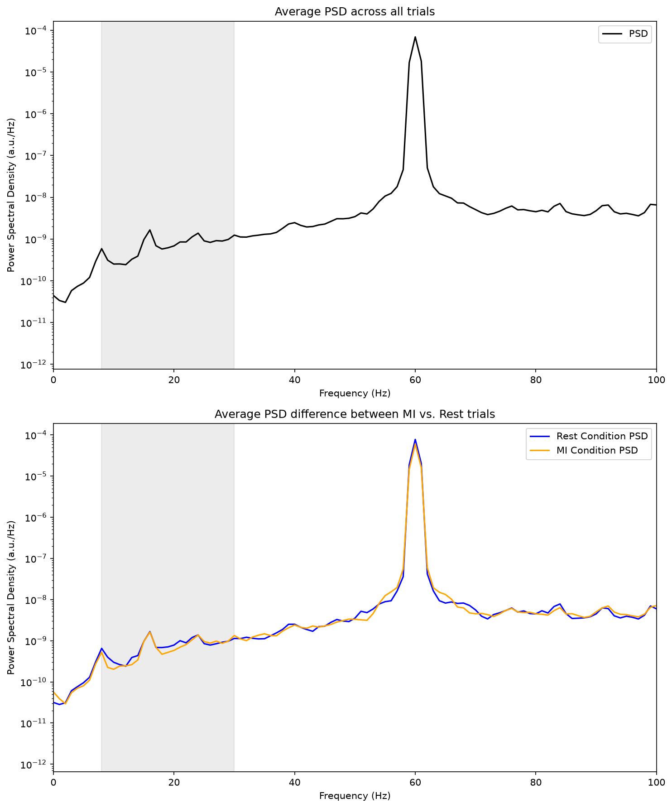
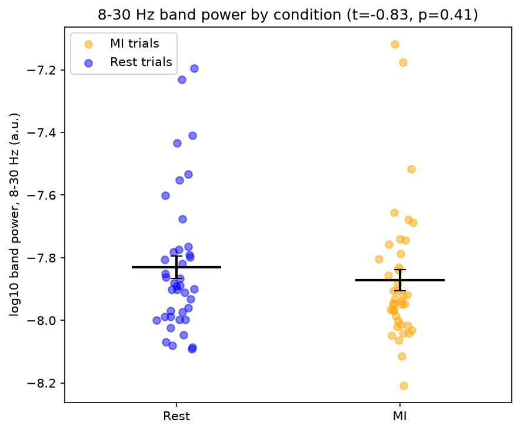

# End to end Motor Imagery BCI

A single-channel motor imagery BCI built end to end: analog front end (AD620 instrumentation amp into TL084CN filter stages), PsychoPy acquisition task, offline classifier training, and a live decoder that emits a keystroke.

**Current state.** The software stages work and are verified against test signals. Acquisition is not yet usable. In the recorded dataset, 60 Hz and its harmonics account for about 96% of total power, measured as ±2 Hz windows around each multiple of 60 up to Nyquist, while the 8–30 Hz band holds roughly 0.0085%. There is effectively nothing to train on.

The most likely cause is the acquisition path. The signal is digitized through the laptop soundcard line-in, which is AC-coupled, designed for line-level rather than microvolt inputs, and has no galvanic isolation. It has also shown playback crackle, microphone bleed, and Bluetooth routing problems.

## Hardware

The front end is built around an AD620 instrumentation amplifier taking the
differential signal between two electrodes, with gain set by an external
resistor. The output passes through a filter chain built from TL084CN
op-amps: a 60 Hz notch, a 7 Hz high-pass, a 31 Hz low-pass, a 1 Hz high-pass,
a second gain stage, and a second 60 Hz notch. The resulting analog passband
is approximately 7-31 Hz, targeting the mu and beta ranges where motor
imagery ERD appears.

Acquisition uses a single-channel cap with two electrodes, one active site
and one mastoid reference, built from hot glue, electrical tape, and a ski
mask.

The signal is then digitized through the laptop soundcard line-in, which is
AC-coupled, designed for line-level rather than microvolt inputs, has no
galvanic isolation, and provides no control over anti-aliasing.

**The 60 Hz problem appears to arrise after ADC via the laptop soundcard mic-in.** The analog chain
contains two independent notch stages, so mains interference entering at the
electrodes should be heavily attenuated before digitization. That 60 Hz and
its harmonics still account for ~96% of digitized power implicates the
acquisition path rather than the amplifier: interference coupling into the
soundcard input, ground loops through the unisolated connection to a
mains-powered laptop, or both. This is the primary hypothesis the next round
of testing is designed to distinguish.

## Installation

```bash
git clone https://github.com/seanbug/Homemade-BCI-Decoder.git
cd Homemade-BCI-Decoder
uv sync
```

`uv sync` installs the core decoding and analysis dependencies. The stimulus presentation task additionally requires PsychoPy:

```bash
uv sync --extra paradigm
```

## Usage

Run the acquisition task (requires the hardware and a PsychoPy install; tested on Windows):

```bash
uv run scripts/Clench_motor_imagery_training.py
```

Train a classifier from a recorded session:

```bash
uv run scripts/train_MI_classifier.py
```

Run the live decoder (requires the hardware):

```bash
uv run scripts/real_time_clench_identifier.py
```

Reproduce the analysis figures below from a session `.npz`:

```bash
uv run scripts/plot_noise_psd.py
uv run scripts/analyze_band_differences.py
```

Recorded sessions are not tracked in this repository, so the analysis scripts require a local `.npz` produced by the acquisition task.

Run the test suite:

```bash
uv run pytest
```

## Results

No classification accuracy is reported from one 80 trial session. The recorded dataset does not contain usable in-band signal, so any cross-validated accuracy would describe the structure of the noise rather than motor imagery.



Welch PSD at 1 Hz resolution, averaged across trials. The 60 Hz peak sits roughly four orders of magnitude above the surrounding floor. Mean PSDs for the two conditions are visually indistinguishable across 8–30 Hz.



Per-trial log10 band power over 8–30 Hz. Error bars are standard error of the mean.

| Condition | n  | mean   | SD    | SE    |
|-----------|----|--------|-------|-------|
| MI        | 40 | -7.872 | 0.217 | 0.034 |
| Rest      | 40 | -7.831 | 0.222 | 0.035 |

t(78) = -0.835, p = 0.41, Cohen's d = -0.19. There is no detectable difference between conditions at this sample size. The negative sign matches the direction expected for event-related desynchronization, but the effect is indistinguishable from chance.

This is a null result, not evidence that motor imagery is absent. With 40 trials per condition on a single channel, the study is only powered to detect large effects, and typical single-channel mu ERD is not large.

Within-condition spread is about one log unit, meaning roughly tenfold trial-to-trial variation in band power with no condition effect. That pattern is consistent with measuring ambient noise rather than physiology.

All 80 trials come from a single session, so the stratified 5-fold cross-validation in `train_MI_classifier.py` shares session-level and drift effects across folds and would overestimate generalization on any future dataset.

## Repository layout

`src/homemade_bci_decoder/`

**`features.py`** is the shared feature extraction, imported by both training and inference. Resamples to 250 Hz, bandpass filters 8–30 Hz, returns log mean band power. Raises on degenerate input rather than substituting a fallback.

`scripts/`

**`Clench_motor_imagery_training.py`** is the PsychoPy task. 40 motor imagery trials (imagined left fist clench) and 40 rest trials, shuffled, 3 s each at 48 kHz, written to a timestamped `.npz`.

**`train_MI_classifier.py`** fits a logistic regression under stratified 5-fold cross-validation and exports the model.

**`real_time_clench_identifier.py`** is the live decoder. Rolling 1 s buffer, features extracted at a fixed update interval, keystroke emitted after several consecutive above-threshold windows as a debounce.

**`EEG_visualizer.py`** is a debug visualizer of the input waveform and its FFT.

**`plot_noise_psd.py`** computes Welch PSDs across trials and by condition, and generates the spectral figures above.

**`analyze_band_differences.py`** computes per-trial 8–30 Hz band power, compares conditions, and generates the band power figure.

`tests/`

**`test_features.py`** asserts that distinct inputs give distinct features, that in-band and out-of-band tones separate, and that degenerate inputs raise.

## Future Directions

- Test the acquisition hardware on another computer to confirm if the 60Hz noise band was due to the previous laptop.
- Depending on that result, either swap in a different audio interface or move to a dedicated biosignal ADC with DC coupling and galvanic isolation.
- Add a contralateral recording channel, since motor imagery ERD is lateralized, and generalize feature extraction to operate over a channel axis rather than a single trace.
- Collect a new dataset on myself once acquisition is validated.
- Split the single broadband feature into separate mu and beta bands, and use multiple channels to make spatial filtering possible.
- Once multichannel acquisition is working, compare hand-engineered band power against a compact CNN operating on the raw signal. EEGNet-style architectures apply temporal convolutions as a learned filterbank followed by depthwise spatial convolutions, avoiding the latency cost of computing an explicit time-frequency representation per inference window.
